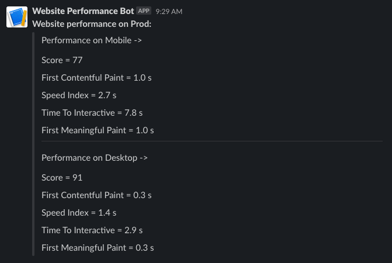

# Website Performance Slack Bot
  
  A slack bot, written in Google App Script, for retrieving latest performance scores for website from Google's PageSpeed Insights API.
  
  This is how it shows up on slack: 
  
  
